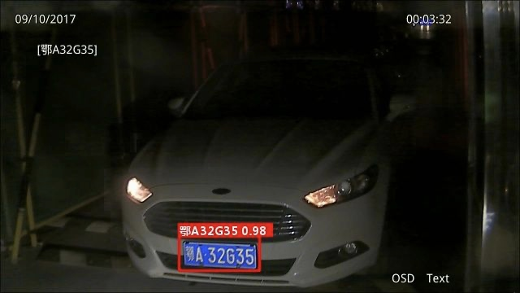
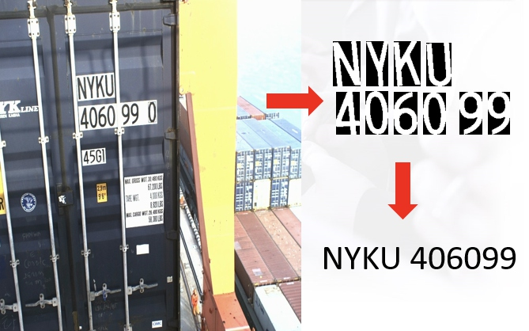
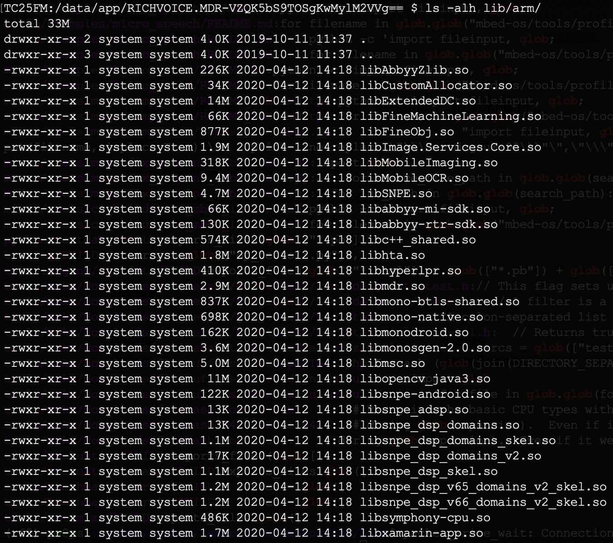

#MDR技术分析
晓光提供的APK由于签名的问题无法安装到EDA51上面，通过APK的名字**RICHVOICE.MDR.Zebra-3.0.6.29-OCR-OCR3-LPR-CNR2-ASR-TTS-191023.apk**可以猜测大致实现了哪些功能，LPR（车牌识别），CNR（集装箱箱号识别）、ASR和TTS都是跟语音识别相关的。
反编译APK没得到有用的信息，跟模型相关的都加密了，无法查看。
##LPR
[LPR车牌识别:](https://github.com/openalpr/openalpr)https://github.com/openalpr/openalpr
[怎么从零实现车牌识别（LPR）:](https://www.zhihu.com/question/48418510)https://www.zhihu.com/question/48418510
[]
车牌识别比较简单，不确定是否是使用的单字符方案，目测很大可能是用的单字符方案去做的，深度学习模型在移动平台的CPU上面很难做到实时。
##CNR
[集装箱箱号识别提升智能理货效率:](https://zhuanlan.zhihu.com/p/28752485)https://zhuanlan.zhihu.com/p/28752485

[]
集装箱箱号识别原理：通过字符切割，对箱号进行识别，从而在理货环节快速对集装箱进行判断，区别于传统理货更具效率。

libAbbyy*  --  Abbyy相关的库
libSNPE.so -- Snapdragon Neural Processing Engine (SNPE)
libhyperlpr.so -- HyperLPR中文车牌识别
libopencv_java3 -- opencv库
libsnpe_dsp* -- 高通dsp相关库
libsymphony-cpu.so -- SNPE相关的库
libmsc.so -- 讯飞语音相关库
libmonodroid.so  libxamarin-app.so -- app开发相关的，Xamarin是Mono创始人Miguel de Icaza创建的公司，旨在让开发者可以用C#编写iOS, Android, Mac应用程序，也就是跨平台移动开发。

