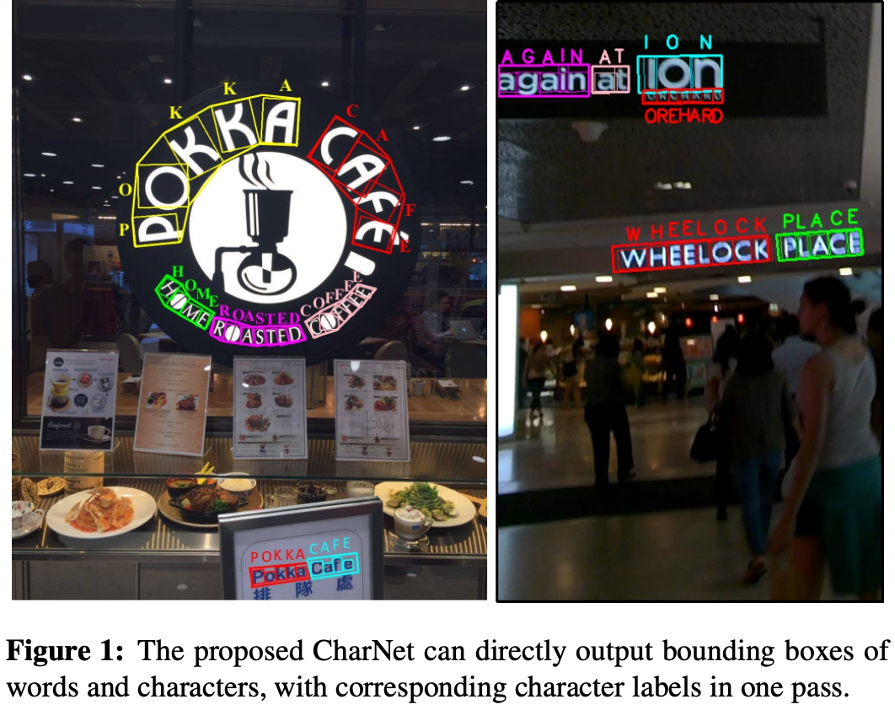

tatus                    [OCR总结]

#1. OCR简介
    OCR识别算法包括传统CV（Computer Vision）算法和深度学习算法，传统CV算法容易落地，由于需要手动调整参数，引入了人为先验知识，很难设计一个通用规则满足所有场景，只适合做简单场景的OCR识别。深度学习可以识别任意场景，但是模型的泛化能力跟训练数据量和模型的复杂度是成正比的，落地比较困难。
    过去一年多的时间中，我尝试过传统CV算法到深度学习算法，有过OCR落地的经验，下面我将按照时间先后顺序介绍我这边的研究内容。
#2. 传统CV算法
    传统CV算法使用Opencv检测文本框或者字符框，用Tesseract识别文本，或者使用CNN图像分类识别字符。
##2.1 Opencv + Tesseract
    使用Opencv检测文本框，将检测到的文本框送给Tesseract识别。这是最早研究的算法，Foghorn OCR Demo使用的就是这套算法。
    Tesseract识别文本的perfermance较差，Tesseract提供了训练的方法，训练后改善不明显。
##2.2 Opencv + CNN
    为了改善上个方法识别文本performance差的问题，先使用Opencv对图片二值化分割，然后从二值化分割图片中检测字符框，最后用CNN图像分类识别单个字符。这套算法用在了光明OCR识别需求上面，得到了客户的认可。
    CNN图像分类识别单个字符performance非常好，Finetuning后单个字符识别准确率可以达到99.97%，识别速度在EDA51 CPU上面benckmark测试，Opencv字符检测平均耗时60ms左右，CNN单个字符识别耗时15ms左右，对于实时性，客户给了极大的肯定。这套算法的瓶颈不是识别，而是检测，使用传统算法检测字符框，很难设计通用规则满足实际场景，当时做光明这个OCR需求最困难的就是字符提取，识别只需要抓取少量样本训练即可。
[]

#3. 深度学习
    使用深度学习进行OCR识别包括两个方法，一个是检测和识别分两个模型，另一个是E2E（End-to-End）模型，E2E将检测和识别放在一个模型里面。
    经过传统CV算法Opencv+CNN落地后，为了改善传统CV算法只能识别有限场景的问题，开始尝试使用深度学习算法。由于深度学习算法复杂度很高，训练数据量很大，一般需要训练很长时间才能够收敛，在使用深度学习算法之前，首先需要解决训练的问题，下面先介绍分布式训练。
##3.1 分布式训练
    Pytorch和Tensorflow都是非常优秀的深度学习框架，用的人也很多，使用Pytorch可以简化研究人员编程工作量，使研究人员可以将更多精力放在算法设计上面。这一两年很多优秀Paper研究人员都是基于Pytorch实现并开源，在开源模型这块积累比Tensorflow多，质量很高。Pytorch模型部署相对于Tensorflow的布局要差很多，使用Pytorch很难将模型部署到移动平台，所以综合考虑，选用Tensorflow作为训练框架，使用TFLite作为移动平台部署框架。
    Tensorflow2相对于Tensorflow1分布式训练做了很多优化，速度更快，但是Tensorflow2相对于Tensorflow1 API变动非常大，导致Tensorflow2基本上没什么开源模型可用，不过Tensorflow2将Keras作为高级API编程接口，统一了编程接口，使用起来非常简单，将Tensorflow1或者Pytorch开源的模型重新用Tensorflow2去实现并不复杂，所以最后使用Tensorflow2作为训练框架。
###3.1.1 服务器环境搭建
    1. Python环境使用Anaconda管理
    2. 训练框架使用Tensorflow2
    3. 可视化使用TensorBoard
###3.1.2 分布式训练搭建
    Ring AllReduce架构相对于Parameter Server架构，减少了多卡之间数据交换的时间成本，大大提升了多卡训练的效率，Tensorflow2已经将AllReduce设置为默认模式。数据加载提供了Dataset接口，大大提升了数据从硬盘拷贝到GPU内存的效率。
    分布式搭建参考的是Tensorflow官网教程，由于官网教程使用的是Tensorflow2较老的版本，实际搭建过程中，完全参考官网上的教程可能会碰到很多错误，碰到错误后，可以去Tensorflow Github issuses页面去查询是否有相似问题，如果没有，可以提交issuse并配合Google开发人员上传需要的日志。如果issuses里面没有相关问题，也可以自己分析Tensorflow源码，想办法先规避掉。
###3.1.3 结果
    在我们的GPU服务器上面实践分布式训练，4张Tesla P4，训练CRNN，训练数据量100k，Epochs为50，只需要25分钟就能训练完，速度很快。训练EAST，训练集为ICDAR2015，Input size为（512，512，3），Epochs为100，只需要27.5分钟就能训练完
##3.2 EAST（DB） + CRNN
    文本检测模型分别尝试了EAST和DB，EAST检测直线文本效果比较好，DB检测弯曲文本效果比较好，EAST和DB Backbone都使用MobileNet，Head不变。EAST在EDA51 CPU上面benckmark测试，Input size为(256x256), 平均Inference时间为114ms。DB在EDA51 CPU上面benckmark测试，Input size为(320x160), 平均Inference时间为153ms。
    文本识别使用CRNN，Backbone使用DenseNet，Head直接在DenseNet后面接分类器，Loss用的CTC。CRNN在EDA51 CPU上面benckmark测试，Input size为(100x32)，平均Inference时间为70ms。
[]
[EAST文本检测]
[]
[CRNN文本识别]
###3.2.1 百度开源OCR分析
    百度前段时间开源了EAST+CRNN OCR识别的方案，他们轻量级检测方案Backbone也是使用的MobileNet，从百度算法研究人员那里了解到，他们的通用模型训练数据量为，文本检测40k，文本识别15000k，实际测试中发现通用模型有很多误识别。基于预训练的模型去Finetuning需要的数据量也很大，具体需要多少数据量他们也没有成熟的实践给出明确数值。
###3.2.2 总结
    EAST+CRNN实现OCR落地最大的困难在于CRNN需要的数据量太大，CRNN需要巨大数据量的原因是因为使用了CTC Loss，CTC极难训练，数据量小很容易过拟合。
##3.3 ABCNet（E2E）
    ABCNet是一个E2E模型，利用多任务学习方法将文本检测和文本识别放在一个模型里面，Mask RCNN已经证明多任务学习可以提升模型的泛化性能。ABCNet Backbone使用的是Resnet50 + FPN，文本检测Head基于Faster RCNN目标检测Head优化，文本识别Feature Map对齐用的Mask RCNN中的ROIAlign，文本识别Head使用的CRNN Head，加入了Attention。
    作者开源了Pytorch版本的代码，在我们自己的服务器上面训练测试，相对于EAST+RCNN效果有提升，ABCNet需要的数据量也小一点。
    原paper中，预训练模型用到的数据集为，150k synthesized data，15k COCO-Text，7k ICDAR-MLT。我这边在服务器上面使用预训练的模型在CTW1500数据集上Finetune，测试效果为
[]
##3.4 CharNet（E2E）
    CharNet也是一个E2E模型，CharNet跟上面的ABCNet Backbone差不多，不同的是文本识别，CharNet是检测单个字符，并对单个字符进行分类，不需要使用CTC Loss，数据量可以少很多。
    这里我把CharNet列出来是因为之前我有个单字符方案落地的经验，我认为单字符识别对于我们来说更容易落地。
[]

##3.5 更多Tricks
    深度学习需要尝试各种Trick，花大量时间去验证Trick，才知道Trick是否对任务有正向提升，下面我列出了几个大佬们已经验证过的可以提升Perfermance的Trick。
###3.5.1 频域学习（Learning in the Frequency Domain）
    频域学习是将输入图像从RGB空间通过DCT转换到频域空间，之前模型的输入接收的是RGB如数，转换到频域空间后，需要修改网络的输入。阿里的研究人员利用频域学习验证，结果如下
[]
[ImageNet]
[]
[Mask R-CNN]

###3.5.2 AutoAugment
    AutoAugment是一种数据增强方法，为了解决深度学习天生的短板，数据不够多，不够好的问题。下面是各种增强方法在几个公开数据集上面的验证结果。
    其中，baseline是默认的数据增强方法。
    PBA：Population Based Augmentation；
    Fast AA：Fast AutoAugment；
    AA：AutoAugment；
    RA：RandAugment。
[]

