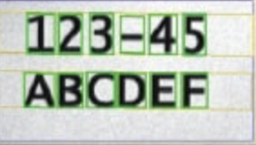

[OCR研究总结]

#OCR简介
目前OCR主要有两种方案，一种方案是先使用***检测算法***从图片中检测***文本***或者***单个字符***的位置，然后将***文本***或者***单个字符***从图片中裁剪出来送给***识别算法***识别出具体的文本内容
[]
[文本检测]
[]
[文本识别]

[]
[单字符识别]

#方案介绍
我这边主要是研究基于移动设备CPU实现OCR识别，移动设备CPU一般计算能力比较差，复杂的算法运算一次的时延会很高，用户使用的时候需要等待较长的时间，影响用户体验。为了实现运算时延和算法复杂度的平衡，我先后做了以下几个尝试，算法有传统CV算法和深度学习CV算法两种选择。
##1. 传统CV算法
这是最早使用的方法，去年4月份刚接到OCR任务的时候尝试使用***Opencv***手动调参检测文本框，然后用***Tesseract***识别检测出来的文本框
###1.1 优点分析
    1. Opencv手动调参检测文本需要的数据量很少，算法复杂度也很低，在EDA51 CPU上面benckmark测试平均耗时在60ms左右
    2. Tesseract可以识别大多数印刷体，对于印刷体的场景基本上不需要为识别算法搜集而外的数据集训练
###1.2 缺点分析
    1. Opencv手动调参引入了人为先验，文本检测算法只能检测已经考虑过的场景，对于没考虑的场景需要增加先验规则才能被正确检测
    2. 使用Opencv文本检测，对于背景复杂或者文字跟背景重叠的情况很难设计一种通用的规则去提取
    3. Tesseract对于像喷码或者背景很复杂的情况识别效果很差，且训练改善也不大
###1.3 结果分析
    使用Opencv + Tesseract 的组合只适用于印刷体简单场景，无法满足工业领域复杂场景的要求，去年基于Foghorn EDA51 OCR识别的Demo是用的这个方案

##2. 传统CV算法结合深度学习算法
先用Opencv手动调参将图片进行二值化分割，然后提取出分割后的字符，使用CNN图像分类的思路识别单个字符
[]
Opencv + CNN的组合对于数据量的依赖不大，但是受限于Opencv手动调参引入了人为先验规则，对于复杂背景和有干扰的情况，很难设计一个通用规则检测到目标字符。
###2.1 结果分析
    这个方案用在了光明OCR识别需求上面，且得到了客户的认可。从落地的角度来讲，如果能够解决字符检测的问题，这个方案应该是最佳方案了。

##3. 深度学习
深度学习很火，所以我也研究了深度学习的方案，基于深度学习的方案有两个方向，一个方向是先使用检测模型检测文本框，然后使用识别模型识别文本框里面的文本内容。还一个方向是End-to-End (E2E)检测和识别用一个模型完成。
###3.1 检测和识别分开
这个方案我尝试了EAST+CRNN的组合，使用EAST检测文本框，使用CRNN识别检测到文本框中的文本内容。
EAST文本检测Backbone用的MobileNet，Head不变，在EDA51 CPU上面benckmark测试，input size为(256x256), 平均Inference时间为114ms。
CRNN文本识别Backbone用的DenseNet，Head去掉了CRNN中RNN的部分，只用了CRNN Head部分的分类器，Loss用的CTC。在EDA51 CPU上面benckmark测试，input size为(100x32), 平均Inference时间为70ms。
####3.1.1 结果分析
    使用EAST加CRNN需要很大的训练数据，这个方案百度前段时间开源了，并发布了一个预训练模型，跟百度OCR负责人沟通，他们预训练模型训练数据量为，文本检测40k，文本识别15000k。经过测试他们的预训练模型，有很多误识别。基于预训练的模型去Finetune需要的数据量也很大，具体需要多少数据量他们也没有成熟的实践给出明确的数据量。

    这个方案目前落地很难主要是因为CTC训练需要海量数据才能收敛，泛化能力较差，如果客户能协助解决数据量的问题，帮忙抓取足够的数据训练算法，这个方案也可以尝试落地。

###3.2 E2E
这个方案研究过ABCNet和CharNet，ABCNet将检测和识别放在了一个模型里面，Backbone用的是Mask RCNN的架构，文本检测Head也是在Mask RCNN Head基础上面修改的，ROIAlign不变，识别Head用的CRNN的Head。
####3.2.1 结果分析
    原paper中，预训练模型用到的数据集为，150k synthesized data，15k COCO-Text，7k ICDAR-MLT。我这边在服务器上面使用预训练的模型在CTW1500数据集上Finetune，测试效果为
[]
E2E模型使用了多任务学习技术，多任务学习在Mask RCNN上面已经验证过是可以提升模型的泛化能力的，所以E2E模型相对于前面那种检测和识别分开的模型是有优势的，但是由于ABCNet识别Head还是用的CTC作为Loss，所以数据量需要很多，Finetune需要一个实际的场景去验证需要多少数据量，才能达到工业识别的要求。
###3.3 CharNet
CharNet也是一个E2E模型，CharNet的backbone跟ABCNet差不多，Head部分使用了跟ABCNet完全不同的技术，CharNet同时检测文本框和文本中的字符框，然后从字符框中直接识别出字符的类别，识别Head不需要像CRNN那么复杂，也不需要用到CTC Loss，从前面做过的单字符方案经验来看，这个方法Finetune只需要少量的数据就可以达到工业级别需要的准确率，潜力很大。
##总结
上面写了这么多，我认为制约OCR落地的根本原因是硬件平台的计算性能和数据量，硬件平台计算能力越强，可以使用泛化性能更好的模型，需要的数据量相对较少，反之，硬件平台计算能力越差，模型需要使用更轻量的架构，泛化能力越差，需要的数据量越多。
我个人认为单字符E2E模型没有使用CTC Loss，数据量不需要那么大，是有很大潜力可以做到通用，并且容易落地的。

