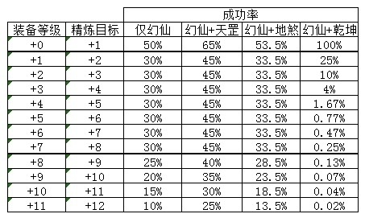
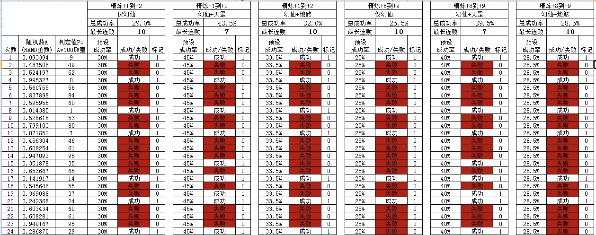
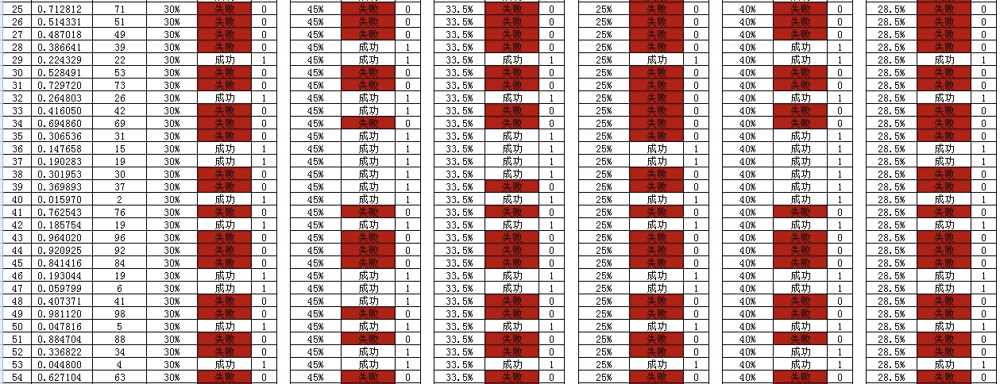

/.[http://w2i.17173.com/content/2013-03-27/20130327145540414_all.shtml](http://w2i.17173.com/content/2013-03-27/20130327145540414_all.shtml)
把我前几天写的文章拿出来跟大家探讨一下
　　
　　作者：电信1区龙吟  莫天心
　　
　　前言
　　
　　本文的数据来自论坛网友的说法，我觉得比较合理所以把它们综合起来，系统论述一下，让大家对精炼有一个深入的认识。我自己是业余程序爱好者，也做过一些不大不小的软件，知道软件设计的基本思路和思想，所以很容易理解我所综合的网友说法的合理性。
　　
　　本文并不是探讨如何提高精炼成功率，恰恰相反，而是要说明：成功与否，纯靠运气。
　　
　　精炼成功率
　　

　　为什么说这个成功率是合理的呢？特别是+2到+8为什么精炼成功率一样？难道不应该逐级降低吗？我是这样想的：所谓收获越大风险越大。当你精炼+7到+8时，成功率虽然不低(30%)，但你有70%的可能性损失一个价值不菲的+7啊。所以程序没必要也不应该再把精炼成功率降低。而是用高风险高代价去“威慑”你。另外，根据网友的经验和感觉，+8到+9是一个台阶，+9到+10是一个台阶，+10到+11是一个台阶，+11到+12是一个台阶，都明显比之前的困难，这与这里的每级降低5%是吻合的。终极精炼目标+12成功率：10%，大家觉得这个是不是还不算太低？其实算很低很低的了！我们知道5%的概率就算小概率，在一次试验中基本不会发生。10%只是5%的2倍而已，仍然是很小的概率。但不是没可能发生，这就是为什么偶尔还是有人不用龙珠也能+12。
　　
　　综上，我觉得这个表的成功率是合理的，应与程序代码相同。当然只是猜测。除非有人能搞到完美公司的程序源代码。
　　
　　精炼判定
　　
　　当服务器实际验证精炼时，生成一个0~999的一个随机数(记为Y)，并用这个随机数除以100取余数，这个余数应该是0-99的一个概率平均的随机值。以+0到+1为例，当这个数小于50即0-50时，系统认为精炼成功，当大50时，认为精炼失败。同理，每个地方郡守/长老精炼某级的概率是服务器内置的，若成功的概率为n%，就把每次生成的随机数与n比较，小于则成功，大于则失败。
　　
　　所以重点是服务器生成随机数的函数Y=f(X)，这个生成的随机数其实就是一个幸运数字，和抛骰子是一样的，但是在计算机中，不可能生成真正的随机数，只能用复杂的公式来生成数，每个公式都有一个初始值(记为X)。当我们打开精炼窗口时，系统会对这个初始值进行初始化，即给X赋值。完美国际初始化方法是以你当前精炼时间的毫秒数*人物等级/坐标-红名度生成第一个种子数X，以这个数为种子，生成你精炼的第一个幸运数Y，再和概率比较，决定你当前精炼是否成功，而不关窗口的第二次精炼，是以前一个幸运数(即令X=Y1)作为种子，计算出你第二次精炼的幸运数(Y2=f(X)=f(Y1))，在不关精炼窗口的情况下，第n次精炼的幸运数是以第n-1次精炼的幸运数作为种子计算出的。
　　
　　没有人知道Y=f(X)的f到底是什么，除非看源代码。可能是Y=X乘以池宇峰身份证号码的后四位再除以1000取余数，也可能是Y=X乘以服务器当前在线人数再除以1000取余数，noideaatall！！！
　　
　　本节开篇就说了Y是个随机数。而f(函数式)是确定的，之所以断定Y是随机数是因为X是随机数。而X之所以成为随机数是因为X=当前精炼时间的毫秒数*人物等级/坐标-红名度中的毫秒数是随机数。试想一下：1秒钟分成1000毫秒，无论你连点多么快速，当前时间的毫秒数都可能取到0-999中的任何一个值，所以这个毫秒数绝对是0-999的概率平均的随机数。所以不用费劲心思去管单次精炼是否成功，你无法把握的，精炼判定值0-99出现任何一个值的机会都是1%。虽然我们已经知道这个随机数跟毫秒数有关，跟人物坐标有关(其实就是找哪个长老精炼的意思)。人物等级，红名度不是变量不考虑，但是你仍然无法控制，最关键的一点就是毫秒数，无论你连续点，还是关窗口重开，所得到的毫秒数仍然会是无规律的随机数。

　　
　　总结：
　　
　　1.精炼跟网速无关，因为延时的话虽然系统读取你的当前时间毫秒数就不一定是你点开窗口的那个时间。但是还是随机数。
　　
　　2.跟时间段无关比如凌晨或者中午，因为系统取的是当前时间的毫秒数，而不是小时/分钟数。
　　
　　3.跟在哪个长老那里精炼无关，因为另外一个因素当前时间的毫秒数是随机数，即使某长老的坐标对你再有利，经过与毫秒数随机值运算，仍然可能不利。
　　
　　4.所谓口诀比如几败一成都是扯淡，随机数是没有规律的。
　　
　　5.跟你关不关精炼窗口无关。因为关与不关，判定值Y会不同，但你能确定关窗口所得的Y一定是成功，不关窗口就是失败吗？说不定正好相反呢？随机数谁说得准？
　　
　　6.一句话：想提高单次精练成功率，你做任何努力都是白搭，随便点就行了。从长期成功率看，应该大致符合上表所示。后面我会举例子。
　　
　　由于判定值Y(取值0-99之间)是随机数，所以我们不用考虑其他的了，毫秒数，人物坐标什么的都不管，直接取一组随机Y值来验证精炼成功或失败。如附件的excel文件。

