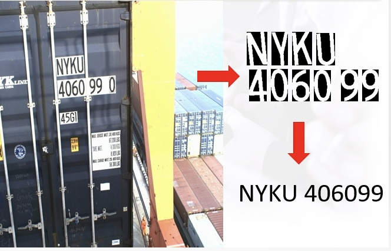
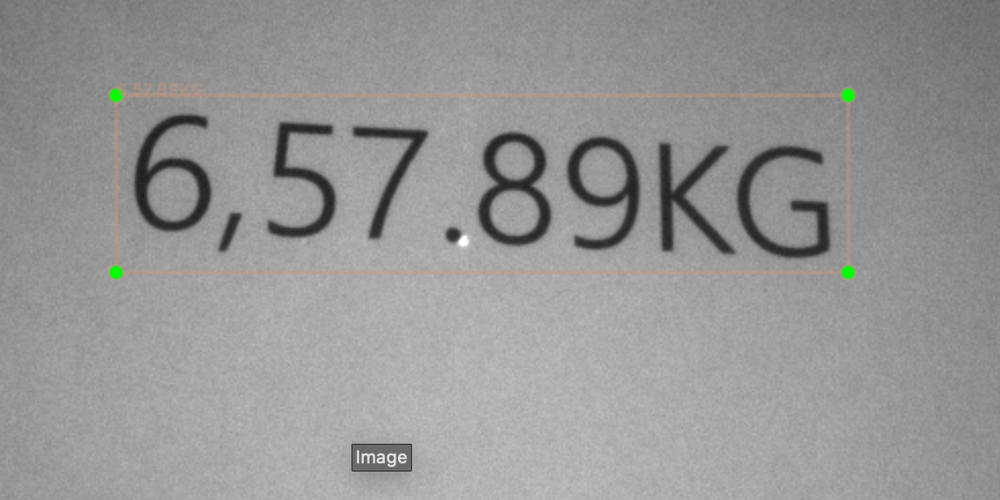
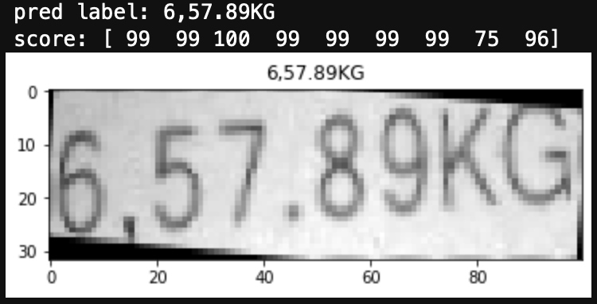

[基于深度学习在移动平台实现OCR算法简介]

#OCR简介
光学字符识别(Optical Character Recognition, OCR)传统上指对输入扫描文档图像进行分析处理，识别出图像中文字信息。场景文字识别(Scene Text Recognition, STR)指识别自然场景图片中的文字信息。也有人将OCR泛指所有图像文字检测和识别技术，包括传统的OCR和STR。
白纸黑字的扫描文档识别技术已经很成熟了，然而自然场景里的文字识别技术，因为其文字展现形式的复杂性，使得在自然场景图像中进行文字识别的难度要远远高于传统扫描文档中进行文字识别。
目前OCR可以用传统CV算法和深度学习两种技术实现。

#基于传统算法的OCR
基于传统算法的OCR需要使用传统CV算法手动调参，如下图所示：先对图像进行二值化分割，然后通过算法拆分单个字符，最后对单个字符进行分类既可以完成识别。

**优点和缺点如下：**
###优点
1. 传统算法可以针对移动平台设计低复杂度的算法，容易满足实时性要求；
2. 针对某个具体识别的场景，传统算法只需要少量数据就可以完成识别。
###缺点
1. 手动调参很难完成复杂场景的识别；
2. 文字有粘连或者背景也是文字的情况下无法拆分个单个字符，导致无法识别；
3. 碰到复杂一点的场景，调参很麻烦。

#基于深度学习的OCR
深度学习的OCR是基于大数据去做的，理论上只要可以收集到足够多的图片数据，可以实现任何场景的文字识别，能够达到甚至超越人的水平，人可以识别深度学习模型必定可以识别。基于深度学习的OCR分两步，第一步先使用**检测模型**对图片中的文本定位，如图1所示，然后将定位到的文本从图片中裁剪出来送给**识别模型**识别即可，如图2所示。
[]
[图1]

[]
[图2]

**优点和缺点如下：**
###优点
1. 图片数据充足的情况下，准确率可以超越人的水平；
2. 检测模型和识别模型都是端到端的，不需要手动调参，训练简单。
###缺点
1. 需要的数据量很大，且需要给数据打标签，需要话费很多成本在数据收集和打标签上面；
2. 模型复杂度相对于移动平台来说偏高，导致无法在移动平台上面达到实时性要求。

