[基于深度学习在移动平台实现OCR算法简介]

#1. OCR简介
光学字符识别(Optical Character Recognition, OCR)传统上指对输入扫描文档图像进行分析处理，识别出图像中文字信息。场景文字识别(Scene Text Recognition, STR)指识别自然场景图片中的文字信息。也有人将OCR泛指所有图像文字检测和识别技术，包括传统的OCR和STR。
白纸黑字的扫描文档识别技术已经很成熟了，然而自然场景里的文字识别技术，因为其文字展现形式的复杂性，使得在自然场景图像中进行文字识别的难度要远远高于传统扫描文档中进行文字识别。
对于场景文字识别，目前存在两种方案，第一种是文字检测＋文字识别，另一种则是一个端到端的模型，在一个模型中完成文字检测和文字识别工作。由于第一种方案准确率比第二种方案要高很多，所以下面重点介绍第一种方案。
##1.1 文字检测
**文字检测的目标是要检测出输入图片中文字所在区域**，看起来和目标检测很相似，但是常规物体的检测方法并不太适用于文字检测任务，因为相对于常规物体，文字行长度，长宽比例范围很大，而且文本行有横向，竖向，弯曲，旋转，扭曲等样式等等。
**CTPN**是一个全卷积网络，以任意尺寸的图像为输入，能够直接在卷积层中定位文本行。
首先使用VGG16网络提取特征，得到conv5的大小为`N*W*H*C`的特征图；然后在conv5的特征图上，使用`3*3`的窗口进行密集滑动，每次滑动得到一个`3*3*C`的特征向量；然后将每一行的`3*3*C`作为双向LSTM的输入，学习每一行的序列特征；后连接一个全连接FC层；最后接一个输出层。
**CTPN**是基于Anchor的，每一个`3*3*C`的slide window预测k个宽度在图片中为16pix，高度为11到273pix像素的anchor，这些anchor在同一水平位置，有k个垂直高度值。
[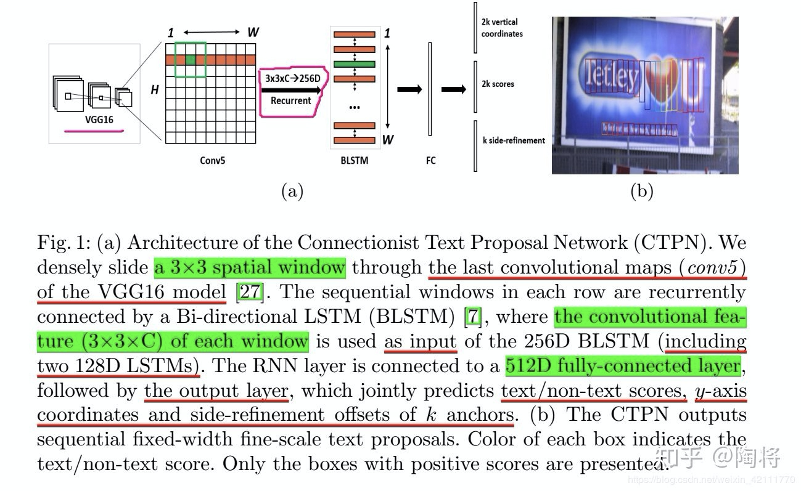]
由于Anchor的设定，**CTPN**检测横向分布的文字效果较好。

##1.2 文字识别
对于文字识别部分，目前存在四种架构，如下图所示，CNN+softmax分类器，CNN+RNN+CTC, CNN+RNN+Attention和CNN+stacked CNN+CTC，这四种架构可大致分为CTC-based方法和Attention－based的方法。
[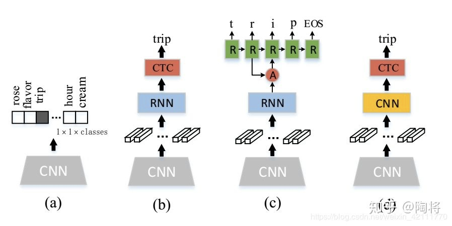]
###1.2.1 CNN+softmax(a)
适合单个字符识别，将单个字符图片当成图像分类问题来处理。经典的单字符识别模型有LeNet。
###1.2.2 CNN+RNN+CTC(b)
CRNN是一个很经典的模型，总体来说就是用CNN提取图片特征；将提取到的特征转换成特征序列作为RNN的输入，用于对卷积层输出的特征序列的每一帧进行预测；最后使用CTC算法将循环层的每帧预测转化为标签序列。
CRNN是一个端到端的模型，因为RNN可以处理任意长度的序列，所以仅仅需要固定输入图片的高度，宽度不定长。
[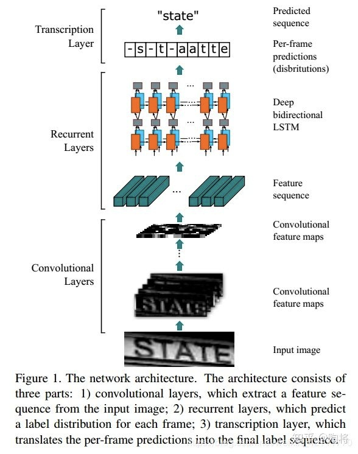]
CRNN是端到端的训练网络，直接从序列标签中学习，对识别的对象不限定长度，仅仅需要height normalization。
###1.2.3 CNN+RNN+attention(c)
这算是基于注意力的文字识别算法，CNN用于提取输入图片的特征，然后将特征序列作为Encoder-Decoder模型的输入，Encoder部分通常选择LSTM对特征序列进行编码，Decoder部分加入Attention机制进行解码，输出标签序列。
[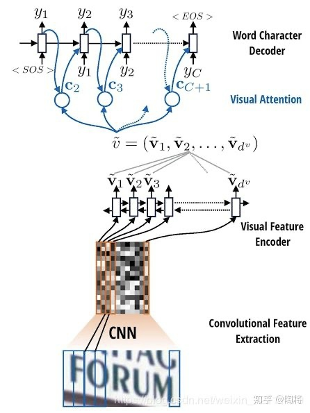]
用CNN提取的特征序列的长度和真实标签的序列长度不等长, Encoder-Decoder模型可映射不定长序列到不定长序列之间的关系，Attention机制允许解码器在每一步的解码过程中，将查询编码器的隐藏状态，通过加权平均，计算可变的上下文向量​，这样网络可以时刻读取最相关的信息，而不必完全依赖于上一时刻的隐藏状态。
仅仅使用AN网络(Attention Network)会出现注意力偏移'attention drift'问题, FAN算法增加一个FN(focusing network)检查AN的注意力是否在图片中的目标字符区域，然后调整注意力。
###1.2.4 CNN+stacked CNN+CTC(d)
不论是CNN+RNN+CTC，还是CNN+RNN+attention,在场景文字识别方面，RNN架构必不可少，但是RNN的串行计算和梯度消失或者梯度爆炸关系使得RNN计算复杂和难以训练，所以在此论文中，作者使用堆叠的卷积网络去获取序列之间的上下文依赖关系；而且为了增强前景文本的显示和抑制背景噪声的影响，作者在一个小的densely connected network中加入residual attention modules。
整个网络架构分为三部分，Attention feature encoder, Convolutional sequence modeling和CTC。Attention feature encoder是一个带有residual attention 的densely connected network，用来提取特征序列，特征序列中的每一个向量都和输入图像中某个局部区域相对应；convolutional sequence modeling使用CNN获取序列中的上下文关系，首先需要将上一步得到的特征序列合并成一个２维的特征图，堆叠的卷积层生成hierarchical representation，能够迅速扩大感受野的大小；最后使用CTC算法获得最后的标签序列。
[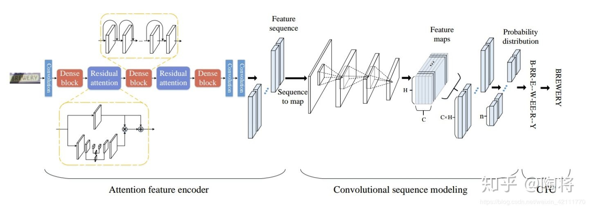]
CNN相对于RNN参数量，消耗更少的内存空间，并且卷积能够并行运算，运算速度比RNN要快。
RNN专门解决时间序列问题的，用来提取时间序列信息，尽管CNN也能提取到序列之间的上下文关系，但还是相对于RNN来说逊色一些。

#2. 基于移动平台的OCR
##2.1 Depthwise separable convolution
MobileNet的基本单元是深度级可分离卷积（depthwise separable convolution），其实这种结构之前已经被使用在Inception模型中。深度级可分离卷积其实是一种可分解卷积操作（factorized convolutions），其可以分解为两个更小的操作：depthwise convolution和pointwise convolution，如图1所示。Depthwise convolution和标准卷积不同，对于标准卷积其卷积核是用在所有的输入通道上（input channels），而depthwise convolution针对每个输入通道采用不同的卷积核，就是说一个卷积核对应一个输入通道，所以说depthwise convolution是depth级别的操作。而pointwise convolution其实就是普通的卷积，只不过其采用1x1的卷积核。图2中更清晰地展示了两种操作。对于depthwise separable convolution，其首先是采用depthwise convolution对不同输入通道分别进行卷积，然后采用pointwise convolution将上面的输出再进行结合，这样其实整体效果和一个标准卷积是差不多的，但是会大大减少计算量和模型参数量。
[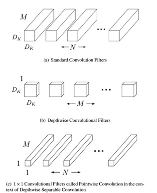]
[图1 Depthwise separable convolution]

[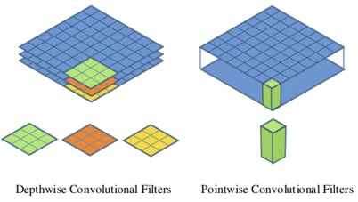]
[图2 Depthwise convolution和pointwise convolution]

##2.2 MobileNet网络结构
前面讲述了depthwise separable convolution，这是MobileNet的基本组件，但是在真正应用中会加入batchnorm，并使用ReLU激活函数，所以depthwise separable convolution的基本结构如图3所示。

[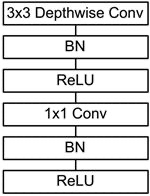]
[图3 加入BN和ReLU的depthwise separable convolution]
MobileNet的网络结构如表1所示。首先是一个3x3的标准卷积，然后后面就是堆积depthwise separable convolution，并且可以看到其中的部分depthwise convolution会通过strides=2进行down sampling。然后采用average pooling将feature变成1x1，根据预测类别大小加上全连接层，最后是一个softmax层。如果单独计算depthwise convolution和pointwise convolution，整个网络有28层（这里Avg Pool和Softmax不计算在内）。我们还可以分析整个网络的参数和计算量分布，如表2所示。可以看到整个计算量基本集中在1x1卷积上，卷积一般通过一种im2col方式实现，其需要内存重组，但是当卷积核为1x1时，其实就不需要这种操作了，底层可以有更快的实现。对于参数也主要集中在1x1卷积，除此之外还有就是全连接层占了一部分参数。
[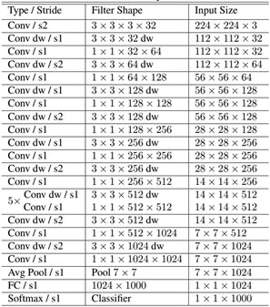]
[表1 MobileNet的网络结构]

[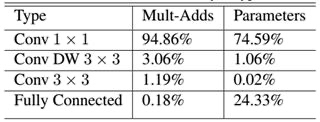]
[表2 MobileNet网络的计算与参数分布]

MobileNet到底效果如何，这里与GoogleNet和VGG16做了对比，如表3所示。相比VGG16，MobileNet的准确度稍微下降，但是优于GoogleNet。然而，从计算量和参数量上MobileNet具有绝对的优势。

[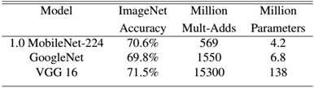]
[表3 MobileNet与GoogleNet和VGG16性能对比]
##2.3 检测模型
###2.3.1 Real-time Scene Text Detection with Differentiable Binarization(DB)

[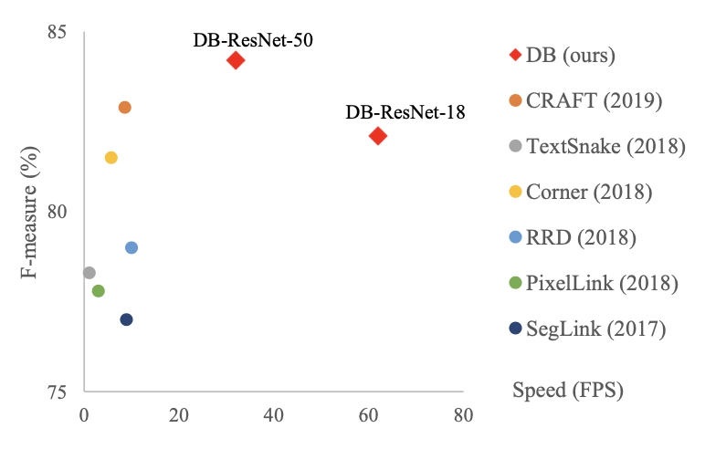]
DB网络paper中的定义backbone使用的是ResNet，由于ResNet相对于移动平台来说，inference速度太慢了，所以在这里我们将DB中的backbone替换为MoblieNet，input shape=(160, 320, 3)在EDA51上面测试inference50次，平均耗时108ms。
##2.4 识别模型
###2.4.1 Densenet + CTC
由于RNN太耗时，这里将RNN移除后在EDA51上面测试，input shape=(32, 100, 1)时，inference50次，平均耗时41ms。

