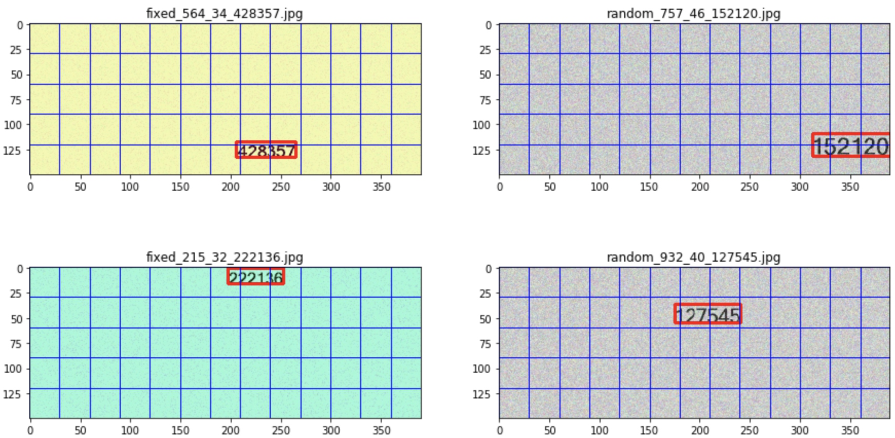

[移动平台少量真实数据实现文本检测和识别的方法]
#背景
深度学习模型的学习能力跟模型的复杂度是成正比的，提升模型的深度或者宽度都能提升模型的复杂度，从而提高模型的学习能力，学习能力越高，在数据充足的条件下，泛化能力就会越好。

#意义和目的
   1. 在实际项目落地的时候，数据是深度学习模型落地的主要瓶颈，在实际的项目中，通常只会有少量的客户数据，或者只有少量标注的数据，怎么使用少量数据实现文本检测和识别是非常有实用价值的研究。
   2. 移动平台的算力有限，模型太复杂会导致计算成本太高，实际项目中一般会对实时性有要求，移动平台不适用复杂的模型，所以平衡好复杂度和学习能力也是非常有实用价值的研究。

#相关研究介绍
1. 先使用tensorflow benchmark工具去评估模型在EDA51上面是否满足实时性的要求，参考之前单字符识别的项目经验，detection model inference耗时应该在100ms以内，recognized model inference耗时应该在300ms以内，对于满足实时性要求的模型在自定义简单数据集（通过图像增强算法生成的数据）上面训练，看是否能够收敛。
2. 使用图像增强算法生成更复杂的数据，去验证上一步收敛模型的泛化能力，复杂的数据可以使用风格迁移，StyleGAN，DCGAN等算法生成
3. 如果泛化能力没达到标准，尝试将复杂数据集中的数据添加到训练集中，看是否能够收敛。
4. 使用真实数据验证上一步收敛模型的泛化能力。
5. 对于不能收敛的情况，可以尝试适当增加模型的复杂度。
6. 真实数据泛化能力差的情况可以考虑使用风格迁移或者自编码器的方式训练backbone，提高特征提取的泛化能力。

#Detection Model
依据上述原则，目前检测模型backbone使用的MobileNetV2，检测模块参考的yolov1，EDA51 inference耗时为80ms，训练数据集如下所示：

#Recognized Model
还没研究到这一步，后续更新